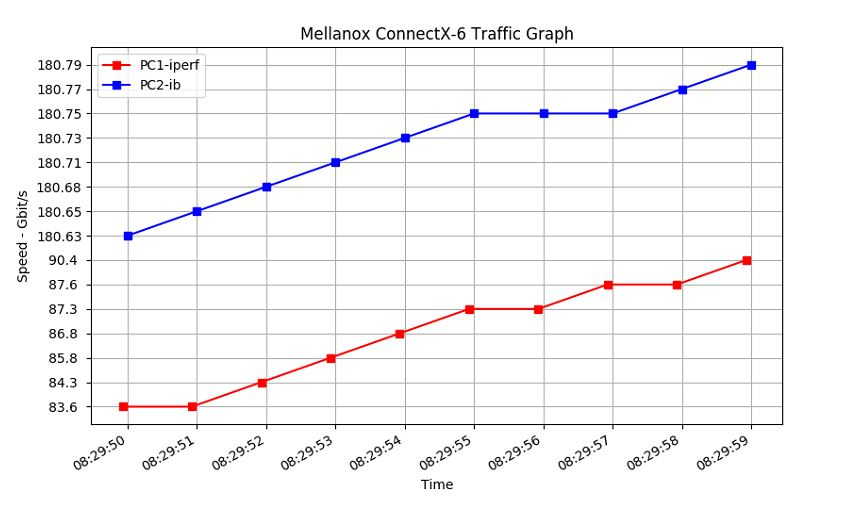

* ### About the Project
	
	Case request : 測試DataCenter的速率 , 利用iperf 以及mellanox 的 tool ,並利用python的matplotlib套件來做速率的繪圖
	
---
* ### Getting Started
	#### Ubuntu 18.04

+ ### Installation - Follow Install Directory

	#### 1. `./install ftp.sh` 
			檔案傳輸用

	#### 2. `./install_network.sh`
	        設定網路
	#### 3. `./install_ubuntu1804_disable_netplan.sh`
            取消新版的netplan,改用舊版的network設定
	#### 4.	`./performance.sh`
            調整網卡的performance,使效能得到最大化(PC)

	####	`./networking_tuning.sh`
			調整網卡的performance,用在Server
	
* ### Run
  
	`start_traffic.sh`
    啟動script
	
    `python plot_show.sh`
    抓取結果並繪製圖形出來

	

