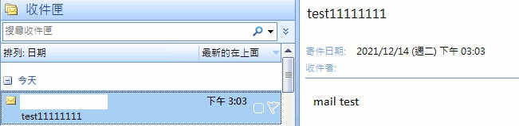
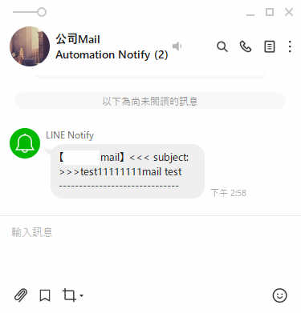

- ### About the Project

  Case request : 利用 line notify 的功能,收取 outlook 的新郵件,並發送到 line notify 通知

---

- ### Getting Started
  #### Windows 7/10

* ### Installation

  #### 1. Download and install python

* ### Package

  #### 1. pip install pexpect / win32

  `pip install request`

  `pip install pywin32`

- ### Run
  1.  開啟工作排程器,加入排程,定時設定時間收信
  2.  啟動程式`python mail.py`

